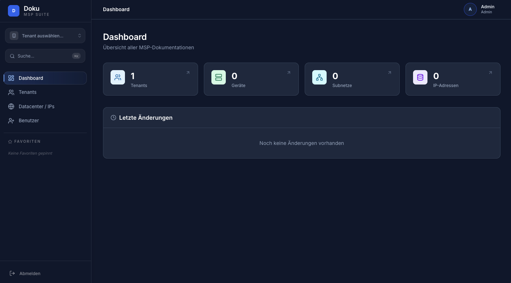
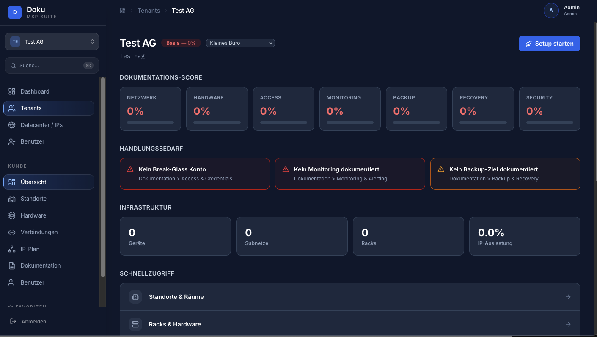
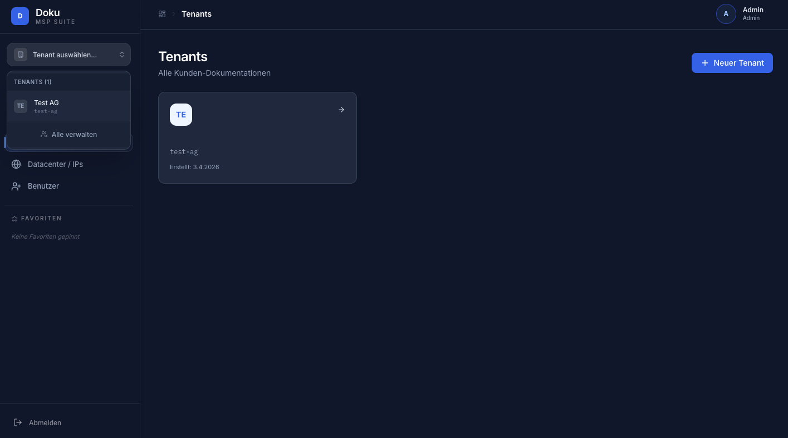
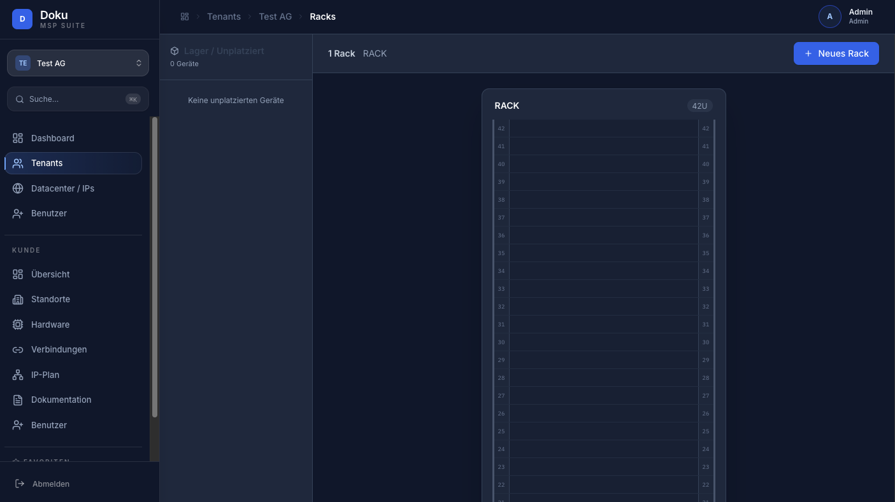

# MSP DokuTool

> **Status: Under active development** -- This is a side project and has not been tested in production environments. It's the beginning of what will hopefully become a really good documentation tool for MSPs. Feel free to try it out and [send feedback](https://github.com/madasy/MSPDokuTool/issues)!

An open-source IT infrastructure documentation tool built specifically for Managed Service Providers (MSPs). Think of it as an open alternative to tools like Hudu or IT Glue -- focused on network documentation, rack visualization, and structured IT documentation per customer.

## Screenshots

### Global Dashboard


### Tenant Dashboard with Health Scores


### Tenant Management


### Rack Visualization


## Features

### Multi-Tenant Customer Management
- Global tenant switcher in the sidebar
- Per-customer infrastructure views
- Customer-specific user accounts with 2FA
- Tenant onboarding wizard (7-step guided setup)
- Documentation health scoring per tenant
- Per-tenant documentation profiles (Small Office, Single Site, Multi Site, Managed, Custom)

### Network & IPAM
- Subnet management with VLAN assignment
- IP address tracking with utilization metrics
- Inline editing for hostnames, status, descriptions
- Public IP range management in the datacenter view
- Individual IP assignment to customers and devices

### Infrastructure
- **Sites & Rooms** -- manage physical locations with inline rack creation
- **Rack Diagrams** -- visual 42U rack layouts with device positioning
- **Hardware Inventory** -- servers, switches, firewalls, APs, patch panels
- **Switch Port Management** -- visual faceplate, VLAN assignment, port status
- **Firewall Interfaces** -- WAN/LAN interface documentation
- **Access Points** -- track APs with location, model, SSIDs, channel
- **Device Connections** -- map physical cable connections between devices

### Structured Documentation (11 Templates)
Pre-built documentation sections per customer with structured fields + free-text notes:

1. **Access & Credentials** -- admin concepts, MFA requirements, break-glass accounts, privileged access paths
2. **Network Architecture** -- VLAN structure, routing design, WAN setup, site-to-site VPN
3. **Critical Services & Dependencies** -- business-critical systems, dependency chains
4. **Backup & Recovery** -- what's backed up, retention policies, RTO/RPO, recovery procedures
5. **Monitoring & Alerting** -- monitored systems, thresholds, alert destinations, escalation
6. **SOPs** -- tenant onboarding, server deployment, VM restore, incident handling
7. **Change & Update Strategy** -- patch management, maintenance windows, change approval
8. **Security Baseline** -- hardening standards, AV/EDR, logging, RBAC
9. **Disaster Recovery** -- datacenter down, ransomware, full tenant loss, recovery order
10. **External Integrations** -- ISPs, cloud providers, SaaS tools, licensing
11. **Naming Conventions** -- server, network, VLAN naming standards

### System Agent (Auto-Discovery)
- Lightweight Go agent for Windows, Linux, and macOS
- Collects system inventory: hostname, OS, CPU, RAM, disk, IPs, uptime
- Collects health data: pending updates, AV status, domain join status
- Reports to the server every 5 minutes via HTTPS
- API key authentication per tenant
- Agent management dashboard with online/offline status

### Authentication & User Management
- Built-in JWT authentication (no external IdP required)
- First-start admin creation wizard
- Three roles: ADMIN, TECHNICIAN, TENANT_USER
- Optional TOTP 2FA (required for tenant users, optional for admins/techs)
- Profile page with 2FA setup (QR code) and password change
- Admin settings page
- Tenant users only see their assigned tenant

### Dashboard & UX
- Action-oriented tenant dashboard with documentation health scores
- 7 category scores: Network, Hardware, Access, Monitoring, Backup, Recovery, Security
- Action cards showing what's missing or needs attention
- Global search across all entities (Cmd+K)
- Progressive disclosure: Required/Recommended/Advanced field levels
- Inline editing in tables
- Guided empty states with step-by-step instructions

## Quick Start

```bash
docker compose up
```

Open **http://localhost:3000**

On first start, you'll be prompted to create an admin account. After that, just login.

Three containers start automatically: PostgreSQL, Spring Boot backend, and React frontend.

## System Agent

The MSP DokuTool agent is a lightweight Go binary that runs on your clients' servers and workstations. It automatically collects system inventory and health data, then reports it to the dashboard.

### 1. Create an API Key

In the app, go to a tenant → **Agents** → **API-Keys** tab → **Neuer API-Key**. Copy the key (it's only shown once).

### 2. Build the Agent

```bash
cd agent
go build -o mspdoku-agent .
```

Or use Docker:
```bash
cd agent
docker build -t mspdoku-agent .
```

Pre-built binaries for Windows, Linux, and macOS will be available in future releases.

### 3. Run the Agent

**Linux/macOS:**
```bash
export MSPDOKU_SERVER=http://your-server:3000
export MSPDOKU_API_KEY=msp_your_api_key_here
export MSPDOKU_INTERVAL=5m

./mspdoku-agent
```

**Windows (PowerShell):**
```powershell
$env:MSPDOKU_SERVER = "http://your-server:3000"
$env:MSPDOKU_API_KEY = "msp_your_api_key_here"
$env:MSPDOKU_INTERVAL = "5m"

.\mspdoku-agent.exe
```

**Docker:**
```bash
docker run -d \
  -e MSPDOKU_SERVER=http://your-server:3000 \
  -e MSPDOKU_API_KEY=msp_your_api_key_here \
  -e MSPDOKU_INTERVAL=5m \
  mspdoku-agent
```

### 4. Run as a Service

**Linux (systemd):**
```ini
# /etc/systemd/system/mspdoku-agent.service
[Unit]
Description=MSP DokuTool Agent
After=network.target

[Service]
Type=simple
Environment=MSPDOKU_SERVER=http://your-server:3000
Environment=MSPDOKU_API_KEY=msp_your_api_key_here
Environment=MSPDOKU_INTERVAL=5m
ExecStart=/usr/local/bin/mspdoku-agent
Restart=always
RestartSec=10

[Install]
WantedBy=multi-user.target
```

```bash
sudo cp mspdoku-agent /usr/local/bin/
sudo systemctl enable --now mspdoku-agent
```

**Windows (as service using NSSM):**
```powershell
nssm install MSPDokuAgent C:\mspdoku\mspdoku-agent.exe
nssm set MSPDokuAgent AppEnvironmentExtra MSPDOKU_SERVER=http://your-server:3000 MSPDOKU_API_KEY=msp_your_api_key_here
nssm start MSPDokuAgent
```

### What the Agent Collects

| Data | Linux | macOS | Windows |
|------|-------|-------|---------|
| Hostname | ✅ | ✅ | ✅ |
| OS name/version | ✅ | ✅ | ✅ |
| Kernel version | ✅ | ✅ | - |
| CPU model + cores | ✅ | ✅ | ✅ |
| RAM total/used | ✅ | ✅ | - |
| Disk total/used | ✅ | - | - |
| IP addresses | ✅ | ✅ | - |
| Uptime | ✅ | - | - |
| Pending updates | ✅ (apt) | - | - |
| Domain join status | - | - | ✅ |

More collectors will be added over time. Contributions welcome!

### Agent Environment Variables

| Variable | Default | Description |
|----------|---------|-------------|
| `MSPDOKU_SERVER` | `http://localhost:3000` | MSP DokuTool server URL |
| `MSPDOKU_API_KEY` | *(required)* | API key from the Agents page |
| `MSPDOKU_INTERVAL` | `5m` | How often to report (e.g. `1m`, `5m`, `15m`) |

## Tech Stack

| Layer | Technology |
|-------|-----------|
| Frontend | React 19, TypeScript, Vite 7, Tailwind CSS 4, React Query 5 |
| Backend | Kotlin, Spring Boot 3.3, Spring Data JPA, Spring Security |
| Database | PostgreSQL 16 |
| Agent | Go 1.22 (single static binary) |
| Auth | Built-in JWT + BCrypt + TOTP |
| Migrations | Flyway |
| Containerization | Docker, nginx |

## Architecture

```
Browser :3000 --> nginx (frontend)
                    |
                    |--> /api/v1/*  --> Spring Boot :8080 --> PostgreSQL :5432
                    |--> /*         --> React SPA (static files)

Servers/Clients --> Go Agent --> POST /api/v1/agent/report (X-API-Key auth)
```

Three Docker containers:
- **mspdoku-frontend** -- nginx serving the React build + proxying API
- **mspdoku-backend** -- Spring Boot REST API with JWT auth
- **mspdoku-postgres** -- PostgreSQL 16

Plus the Go agent binary running on monitored systems.

## Development

### Run with Docker (recommended)

```bash
docker compose up --build
```

### Run locally (without Docker)

**Prerequisites:** Java 21, Node.js 22, PostgreSQL 16, Go 1.22 (for agent)

```bash
# 1. Start PostgreSQL (or use Docker for just the DB)
docker compose up -d postgres

# 2. Start backend
cd backend
./gradlew bootRun

# 3. Start frontend (in another terminal)
cd frontend
npm install
npm run dev

# 4. Build and run agent (optional)
cd agent
go build -o mspdoku-agent .
MSPDOKU_API_KEY=your_key ./mspdoku-agent
```

Frontend dev server runs at `http://localhost:5173` with API proxy to `localhost:8080`.

### Reset database

```bash
docker compose down -v
docker compose up
```

## API Endpoints

### Authentication

| Method | Endpoint | Auth | Description |
|--------|----------|------|-------------|
| GET | `/api/v1/auth/config` | Public | Check if setup is required |
| POST | `/api/v1/auth/setup` | Public | Create first admin (first start only) |
| POST | `/api/v1/auth/login` | Public | Login with email + password |
| POST | `/api/v1/auth/totp/verify` | Public | Verify TOTP code after login |
| GET | `/api/v1/auth/me` | Auth | Get current user info |
| PUT | `/api/v1/auth/me/password` | Auth | Change own password |
| POST | `/api/v1/auth/me/totp/setup` | Auth | Get TOTP QR code |
| POST | `/api/v1/auth/me/totp/confirm` | Auth | Confirm TOTP setup |

### Agent

| Method | Endpoint | Auth | Description |
|--------|----------|------|-------------|
| POST | `/api/v1/agent/report` | X-API-Key | Submit inventory report |
| GET | `/api/v1/agent/reports?tenantId=` | JWT | List agent reports |
| GET | `/api/v1/agent/keys?tenantId=` | JWT | List API keys |
| POST | `/api/v1/agent/keys` | JWT | Create API key |
| DELETE | `/api/v1/agent/keys/{id}` | JWT | Delete API key |

### User Management (Admin only)

| Method | Endpoint | Description |
|--------|----------|-------------|
| GET | `/api/v1/users` | List all users |
| POST | `/api/v1/users` | Create user |
| PUT | `/api/v1/users/{id}` | Update user |
| DELETE | `/api/v1/users/{id}` | Deactivate user |
| POST | `/api/v1/users/{id}/reset-password` | Reset password |
| POST | `/api/v1/users/{id}/reset-totp` | Reset 2FA |

### Global

| Method | Endpoint | Description |
|--------|----------|-------------|
| GET | `/api/v1/dashboard/stats` | Aggregate counts |
| GET | `/api/v1/dashboard/activity?limit=20` | Recent changes |
| GET | `/api/v1/tenants` | List all tenants |
| POST | `/api/v1/tenants` | Create tenant |
| GET | `/api/v1/tenants/{id}/health` | Tenant health score |
| GET | `/api/v1/search?q=query` | Global search |
| GET | `/api/v1/datacenter/ip-ranges` | Public IP ranges |

### Tenant-Scoped

| Method | Endpoint | Description |
|--------|----------|-------------|
| GET | `/api/v1/tenants/{id}/summary` | Infrastructure summary |
| GET | `/api/v1/devices?tenantId={id}` | Devices |
| GET | `/api/v1/racks?tenantId={id}` | Racks with devices |
| GET | `/api/v1/sites?tenantId={id}` | Sites |
| GET | `/api/v1/rooms?siteId={id}` | Rooms |
| GET | `/api/v1/network/subnets?tenantId={id}` | Subnets |
| GET | `/api/v1/network/subnets/{id}/ips` | IP addresses |
| GET | `/api/v1/devices/{id}/ports` | Switch ports |
| GET | `/api/v1/access-points?tenantId={id}` | Access points |
| GET | `/api/v1/tenants/{id}/docs` | Documentation overview |
| PUT | `/api/v1/tenants/{id}/docs/{type}` | Update documentation |
| GET | `/api/v1/connections?tenantId={id}` | Device connections |

## Project Structure

```
MSPDokuTool/
  agent/                    # Go system agent
    main.go                 # Cross-platform inventory collector
    Dockerfile              # Agent container build
    go.mod
  backend/
    src/main/kotlin/com/msp/doku/
      controller/           # REST endpoints
      service/              # Business logic (Auth, JWT, TOTP, Agent, CRUD)
      repository/           # JPA repositories
      domain/               # Entities (Tenant, Device, Rack, User, AgentReport, ...)
      dto/                  # Data transfer objects
      config/               # Security, JWT filter, CORS
    src/main/resources/
      db/migration/         # Flyway SQL migrations (V1-V15)
  frontend/
    src/
      auth/                 # AuthProvider (JWT context)
      pages/                # Page components (Dashboard, Hardware, Agents, ...)
      components/           # Reusable UI (Layout, Toast, InlineEdit, FieldGroup, ...)
      services/             # API client wrappers
      hooks/                # Custom React hooks (useFieldLevel, useFavorites, ...)
  docker-compose.yml        # postgres + backend + frontend
```

## Contributing

This project is in its early stages. If you're an MSP looking for a documentation tool, give it a try and let me know what works and what doesn't.

- Report bugs and feature requests via [GitHub Issues](https://github.com/madasy/MSPDokuTool/issues)
- Pull requests are welcome
- Agent collectors for more platforms/data points are especially welcome

## License

This project is licensed under the [GNU General Public License v3.0](LICENSE) -- see the LICENSE file for details.
